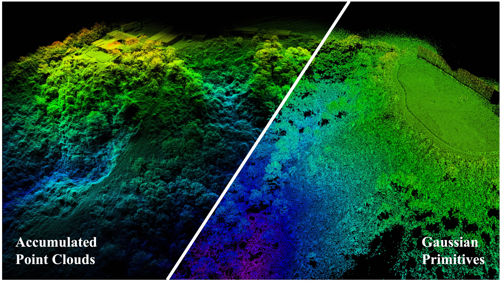

# AKF-LIO

## AKF-LIO: LiDAR-Inertial Odometry with Gaussian Map by Adaptive Kalman Filter

## 1. Introduction
Existing LiDAR-Inertial Odometry (LIO) systems typically use sensor-specific or environment-dependent measurement covariances during state estimation, leading to laborious parameter tuning and suboptimal performance in challenging conditions (e.g., sensor degeneracy and noisy observations). Therefore, we propose an Adaptive Kalman Filter (AKF) framework that dynamically estimates time-varying noise covariances of LiDAR and Inertial Measurement Unit (IMU) measurements, enabling context-aware confidence weighting between sensors. During LiDAR degeneracy, the system prioritizes IMU data while suppressing contributions from unreliable inputs like moving objects or noisy point clouds. Furthermore, a compact Gaussian-based map representation is introduced to model environmental planarity and spatial noise. A correlated registration strategy ensures accurate plane normal estimation via pseudo-merge, even in unstructured environments like forests. Extensive experiments validate the robustness of the proposed system across diverse environments, including dynamic scenes and geometrically degraded scenarios. Our method achieves reliable localization results across all MARS-LVIG sequences and ranks 8th on the KITTI Odometry Benchmark.

    

### 1.1 Related video

Our accompanying video is now available on [**YouTube**](https://youtu.be/2o5CKeNb-7s).

### 1.2 Related paper

[AKF-LIO: LiDAR-Inertial Odometry with Gaussian Map by Adaptive Kalman Filter](https://arxiv.org/pdf/2503.06891)  

### Contact

If you have any questions, please feel free to contact: Xupeng XIE [xxieak@connect.ust.hk](mailto:xxieak@connect.ust.hk).